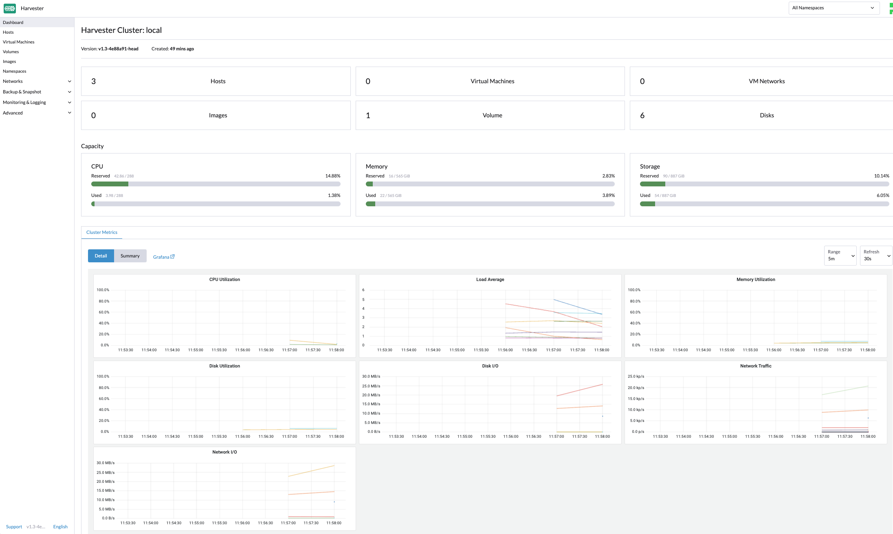
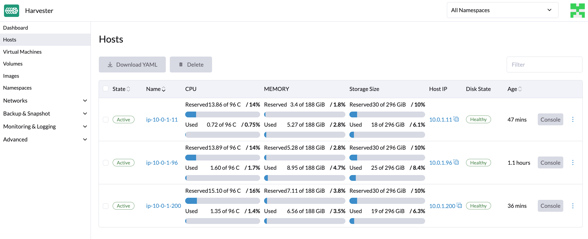

# aws-harvester-terraform
WIP - Terraform to bootstrap DevTest Harvester cluster on AWS EC2 metal instances

## Harvester on AWS Metal



## Overview
The terraform creates a 3 nodes with multiple NICs and multiple subnets

There are some bash scripts that ssh to the nodes and perform various install operations.

A one node rke2 kubernetes cluster is installed first, then the kubeconfig file is
copied down locally where the reset of the scripts run using local kubectl and helm 
commands.

Local commands needed:
* terraform
* kubectl
* helm
* direnv or add `export KUBECONFIG=./local/admin.conf` to your shell

## Configuration
The terraform uses `./tf/terraform.tfvars` (see `./tf/terraform.tfvars.example` to copy)
for the infra and rke2 cluster deployment, edit as desired.  
Different cluster instances can be created using different `prefix`
and `route53_subdomain` variable values.

You will need a route53 domain and hosted zone for the subdomain and DNS entries to 
be created in, update the `route53_zone_id` and `route53_domain` variables accordingly.

The "params.sh" script is included by the install scripts to set various 
variables for ssh and software versions.  At time on initial commit the version values
are:
```
# rke2
#RKE2_VERSION="v1.27.3+rke2r1"
RKE2_VERSION="v1.27.10+rke2r1"
RKE2_TOKEN="harvjointoken"

# rancher
#RANCHERSYSTEMUPGRADECONTROLLER="v0.13.3"
RANCHERSYSTEMUPGRADECONTROLLER="v0.13.1"
# leave RANCHERIMAGETAG blank for latest version
RANCHERIMAGETAG="v2.8.2"
#RANCHERCHARTSBRANCH="dev-v2.8"
RANCHERCHARTSBRANCH="release-v2.8"
#RANCHERMONITORINGCRD="102.0.5+up40.1.2"
RANCHERMONITORINGCRD="103.1.0+up45.31.1"

# harvester
HARVESTERREPOBRANCH="release-1.3"
BOOTSTRAPADMINPWD=admin
```

## Installation

### Infra for the cluster (2 minutes apply + 2-3 minutes for rke2 cluster to be ready)
```
cd tf
terraform init
terraform plan

terraform apply -auto-approve
cd ..
```

### Clean local subdirectory from any previous runs
```
./00--clean-local-dir
```

### RKE2 install - node 1

Due to the way Harvester configures the underlying Kubernetes cluster parameters it 
is necessary to initially fully install the first node before adding additional nodes
to the cluster.  

RKE2 is installed on master1 using the script:
```
./01-install-rke2-master1.sh
```

note: the scripts source include `load-tf-output.sh` which loads bash variables from 
the terraform output values.  Addionally there is a `utils.sh` which is included to
provide some log highlighting functions and elapsed duration values.


### Rancher install - node 1

Rancher Manager is used as part of Harvester, notably the UI, monitoring etc

Rancher install is handled by running the script:
```
./02-install-rancher.sh
```

### Harvester

Harvester components are installed by running the script:
```
./03-install-harvester.sh
```

Note that this takes some time to complete, the script will loop waiting for the kubernetes
resources to all become complete, the loop displays a count of componets still "settling" or
failing.

A component reverse engineered from the GA installer is an internal bootstrap 
helm repo service, this is deployed using resource definitions in the `harvester-bootstrap-repo` 
subdirectory


### Example install output
[Example Install Output](docs/example-install-output.md)


### UI Access
If all was successful, access the cluster at 
```
open https://<prefix>-master-1.<route53_subdomain>.<route53_domain>
```
The admin user bootstrap password in the script has been set to "admin"


### Additional Nodes

Additional nodes are added to the cluster one at a time, allowing them to fully initialise 
before progressing to the next, this is achieved using the script:
```
./04-install-rke2-masterx.sh
```


### Harvester Addons

Harvester addons are configured using the bare-metal installer, this dev install approach
does not have access to that so I have reverse engineered a couple of them from a post 
installed GA Harvester cluster, namely `vm-import-controller` and `rancher-monitoring`, WIP
to add more of the addons.

Load the harvester addons using the script:
```
./05-load-harvester-addons.sh
```


### Post Config
There are addional storage volumes attached to the instances, these can be added to 
each of the nodes via the UI to increase the size of the longhorn storage pool.

The addional network interfaces and subnet is a WIP attempt to be able to configure
a VM Network (with VLAN 1) however more work needs to be done to figure out IP Address
pool allocation and network between nodes on non-AWS assigned IP address values.


## Clean up
```
cd tf
terraform destroy -auto-approve
cd ..
./00-clean-local-dir
```

note: Added `./ssh/known_hosts` entries for the hosts should be manually tidied to avoid future instances on same IPs rejecting interactive ssh connections


## Current Issues
* Needs bare metal instance types for nested virtualisation
* addons - only prepared the manifests for a couple of them, plan to add the rest at some point
* Adding additional nodes is somewhat unreliable, some things don't always initialise, think there is a timing condition somewhere
* VM Networking, need to extend my AWS knowledge to provide a pool of *valid* IPs to the second subnet that can be used. Also concerned there may be issues with the vxlan traffic in AWS infra that might need addional network config when created.  VM guest networking does works when connecting to the management network with cni NAT IP address assignments etc.
* Image import local file upload has a 10MB limitation from the AWS nginx ingress components so need to use URL image instead, example `https://download.cirros-cloud.net/0.5.1/cirros-0.5.1-x86_64-disk.img` - note Cirros image doesn't support cloud-init
* Harvester has a linux VIP associated with NIC1, testing adding a fixed IP address in terraform that is then available in the instance to detach from master1 NIC3 and associate with NIC1, but not progressed this idea further


## Contribution
Very happy to colaborate and learn from others, if you spot something please get in touch and help where I fall short :)
This repo is a dev / test setup of Harvester and sharing as it's useful to make config / version changes and quickly see the results, it also helped me dig into how Harvester is constructed.


